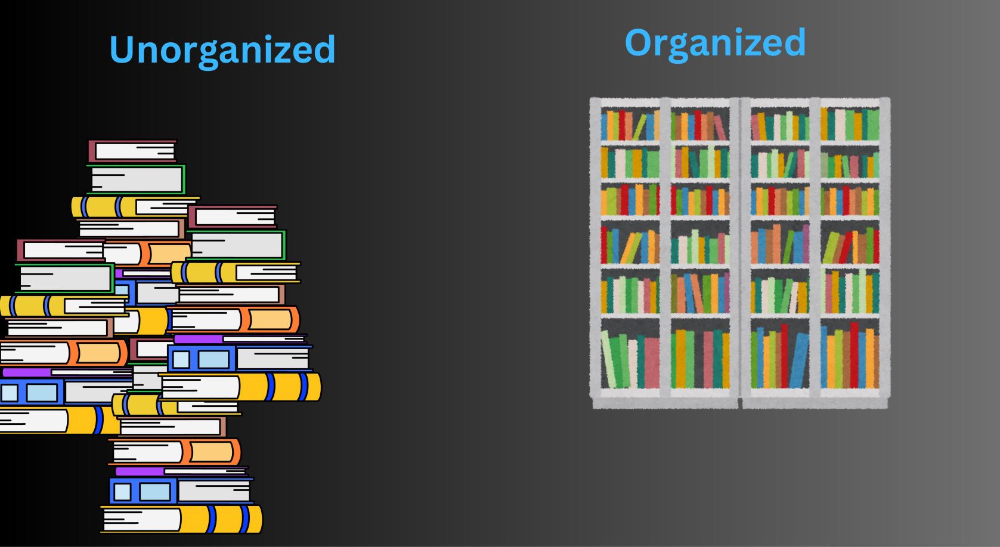
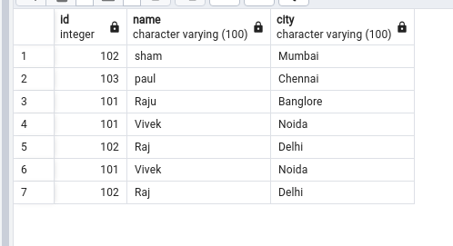
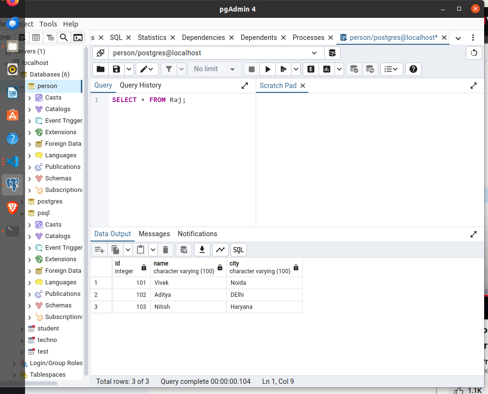
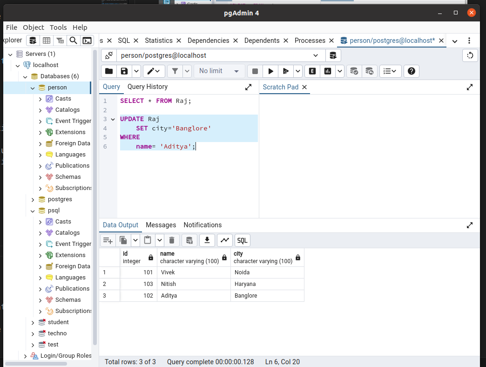
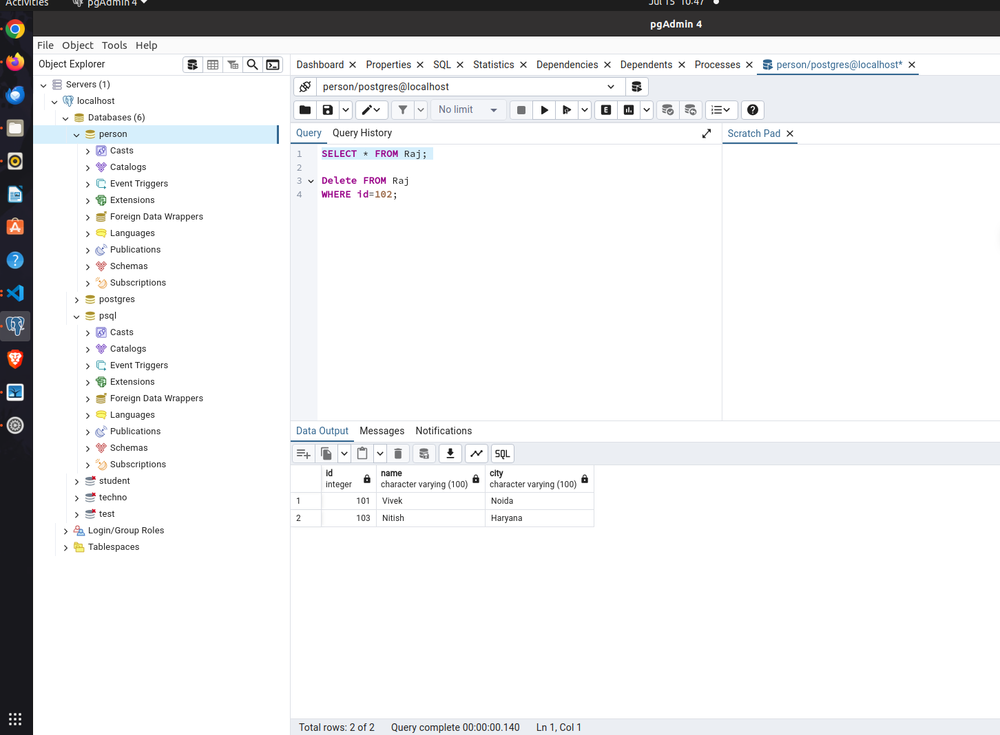

<div style="text-align: center;">
  <h1>PostgreSQL</h1>
</div>

<div style="text-align: center;">
  
</div>

</br>


<h1 style="text-align: center;"> TAble of content </h1>

# PostgreSQL

1. [Introduction of PostgreSQL](#Introduction-of-PostgreSQL)
2. [What is Database](#What-is-Database)
3. [Database vs DBMS](#Database-vs-DBMS)
4. [What is RDBMS](#what-is-RDBMS)
5. [Installation of PostgreSQL](#Installation-of-PostgreSQL)
6. [What is CRUD](#What-is-CRUD)
7. [Datatypes and Constraint](#Datatypes-and-Constraint)
8. [Clause](#clause)


## Introduction of PostgreSQL

PostgreSQL is a powerful, open source object-relational database system that uses and extends the SQL language combined with many features that safely store and scale the most complicated data workloads.

Being an open-source software, its source code is available under PostgreSQL license, a liberal open source license. Anyone with the right skills is free to use, modify, and distribute PostgreSQL in any form. As it is highly stable, very low effort is required to maintain this DBMS.

## What is Database

A database is an organized collection of data, stored and accessed electronically. Databases are used to store and manage large amounts of structured and unstructured data, and they can be used to support a wide range of activities, including data storage, data analysis, and data management. 

<div style="text-align: center;">
  
</div>

</br>

<!-- <div style="text-align: center;"> -->
  
</div>

## Database vs DBMS

**Database:** A database is an organized collection of structured data or information, typically stored electronically in a computer system. It can include tables, queries, reports, views, and other objects that hold and manage data

Example :- Customer data (Name, Address & Contact No.)

</br>

**DBMS (Database Management System):** It is a software that provides an interface for users to interact with databases. It allows users to create, manage, manipulate, and query databases efficiently.DBMS handles tasks such as data storage, retrieval, updating, security, and data integrity

Example :- MySQL, PostgreSQL, MOngoDB, Oracle Database. 

</br>

## What is RDBMS

A type of database system that stores data in structured tables (using rows and columns) and uses SQL (Structure query language) for managing and quering data.

Example :- MySQL, PostgreSQL & Oracle etc.

## Installation of PostgreSQL

**Prerequisite for Installation**

The minimum hardware & software required to install and run PostgreSQL is:

  1. GHz processor. </br>
  2. 4 GB of RAM.  </br>
  3. Ubuntu 20.04.6 LTS (Operating system) </br>
  4. 64 bit </br>
  5. 512 MB of HDD.</br>
  

**Steps for Installation of PostgreSQL**

***Step 1 :-***  Command for install PostgreSQL

``` sudo apt-get install postgresql```

### Output 

```
vivek@phdsec:~$ sudo apt-get install postgresql-16
Reading package lists... Done
Building dependency tree  	 
Reading state information... Done
postgresql-16 is already the newest version (16.3-1.pgdg20.04+1).
postgresql-16 set to manually installed.
0 upgraded, 0 newly installed, 0 to remove and 25 not upgraded
```

***Step 2 :-***  Import the repository signing key:

``` sudo apt install curl ca-certificates ```

### Output

``` sudo apt install curl ca-certificates
Reading package lists... Done
Building dependency tree  	 
Reading state information... Done
ca-certificates is already the newest version (20230311ubuntu0.20.04.1).
curl is already the newest version (7.68.0-1ubuntu2.22).
The following packages were automatically installed and are no longer required:
  linux-headers-5.15.0-105-generic linux-hwe-5.15-headers-5.15.0-105 linux-image-5.15.0-105-generic linux-modules-5.15.0-105-generic linux-modules-extra-5.15.0-105-generic
Use 'sudo apt autoremove' to remove them.
```
***Step3 :-*** Create the repository configuration file:

``` 
 sudo sh -c 'echo "deb [signed-by=/usr/share/postgresql-common/pgdg/apt.postgresql.org.asc] https://apt.postgresql.org/pub/repos/apt $(lsb_release -cs)-pgdg main" > /etc/apt/sources.list.d/pgdg.list'
```

***step4 :-*** ``` psql --version ```

### Output

``` vivek@phdsec:~$ psql --version
psql (PostgreSQL) 16.3 (Ubuntu 16.3-1.pgdg20.04+1)
```


## Installation of pgadmin

We can use pgAdmin to do everything from writing basic SQL queries to monitoring our databases and configuring advanced database architectures 

***Step1 :-*** Install the public key for the repository (if not done previously):

```curl -fsS https://www.pgadmin.org/static/packages_pgadmin_org.pub | sudo gpg --dearmor -o /usr/share/keyrings/packages-pgadmin-org.gpg```


***Step2 :-*** Create the repository configuration file:

```
sudo sh -c 'echo "deb [signed-by=/usr/share/keyrings/packages-pgadmin-org.gpg] https://ftp.postgresql.org/pub/pgadmin/pgadmin4/apt/$(lsb_release -cs) pgadmin4 main" > /etc/apt/sources.list.d/pgadmin4.list && apt update'
```

### Output

```vivek@phdsec:~$ sudo sh -c 'echo "deb [signed-by=/usr/share/keyrings/packages-pgadmin-org.gpg] https://ftp.postgresql.org/pub/pgadmin/pgadmin4/apt/$(lsb_release -cs) pgadmin4 main" > /etc/apt/sources.list.d/pgadmin4.list && apt update'
Hit:1 https://brave-browser-apt-release.s3.brave.com stable InRelease
Hit:2 https://deb.nodesource.com/node_20.x nodistro InRelease            	 
Get:3 https://packages.microsoft.com/repos/code stable InRelease [3,590 B]    
Hit:4 http://in.archive.ubuntu.com/ubuntu focal InRelease                	 
Get:5 https://packages.microsoft.com/repos/code stable/main arm64 Packages [17.5 kB]
Get:34 http://security.ubuntu.com/ubuntu focal-security/universe Translation-en [208 kB]
Fetched 13.6 MB in 14s (1,006 kB/s)                                      	 
Reading package lists... Done
Building dependency tree  	 
Reading state information... Done
5 packages can be upgraded. Run 'apt list --upgradable' to see them.
N: Skipping acquire of configured file 'main/binary-i386/Packages' as repository 'https://brave-browser-apt-release.s3.brave.com stable InRelease' doesn't support architecture 'i386'
N: Skipping acquire of configured file 'main/binary-i386/Packages' as repository 'https://apt.postgresql.org/pub/repos/apt focal-pgdg InRelease' doesn't support architecture 'i386'
```


***Step3 :-*** ```sudo apt install pgadmin4```

### Output

``` 
vivek@phdsec:~$ sudo apt install pgadmin4
[sudo] password for vivek:
Reading package lists... Done
Building dependency tree  	 
Reading state information... Done
The following packages were automatically installed and  are no longer required:
  linux-headers-5.15.0-105-generic linux-hwe-5.15-headers-5.15.0-105
  linux-image-5.15.0-105-generic linux-modules-5.15.0-105-generic
  linux-modules-extra-5.15.0-105-generic
Use 'sudo apt autoremove' to remove them.
The following additional packages will be installed:
  libapache2-mod-wsgi-py3 pgadmin4-desktop pgadmin4-server pgadmin4-web
The following NEW packages will be installed:
  libapache2-mod-wsgi-py3 pgadmin4 pgadmin4-desktop pgadmin4-server
pgadmin4-web
Setting up pgadmin4 (8.9) ...
Processing triggers for mime-support (3.64ubuntu1) ...
Processing triggers for hicolor-icon-theme (0.17-2) ...
Processing triggers for gnome-menus (3.36.0-1ubuntu1) ...
Processing triggers for desktop-file-utils (0.24-1ubuntu3) ...
```

***Step4 :-*** Configure the web server, if We installed pgadmin4-web

``` sudo /usr/pgadmin4/bin/setup-web.sh```

#### Output

```
vivek@phdsec:~$ sudo /usr/pgadmin4/bin/setup-web.sh
Setting up pgAdmin 4 in web mode on a Debian based platform...
Creating configuration database...
Email address: vivekraj746189@gmail.com
Password:
Retype password:
pgAdmin 4 - Application Initialisation
======================================

Creating storage and log directories...
We can now configure the Apache Web server for you. This involves enabling the wsgi module and configuring the pgAdmin 4 application to mount at /pgadmin4. Do you wish to continue (y/n)? y
The Apache web server is running and must be restarted for the pgAdmin 4 installation to complete. Continue (y/n)? y
Apache successfully restarted. You can now start      using     pgAdmin 4 in web mode at http://127.0.0.1/pgadmin4
```

   ***step5 :-*** Open file of pgadmin & change password

   Open file of pgadmin

   ```
   vivek@phdsec:~$ sudo -i -u postgres
   [sudo] password for vivek: 
   direct://
   postgres@phdsec:~$ psql
   psql (16.3 (Ubuntu 16.3-1.pgdg20.04+1))
   Type "help" for help.

   postgres=# ^C
   postgres=# 
   ```
  
   Change Password

   ```
   postgres=# \password
   Enter new password for user "postgres":
   Enter it again:
  ```
   ## What is CRUD

   CRUD stands for Create, Read, Update, and Delete. These are the four basic operations that can be performed on data in a database or a data store. Here’s a brief explanation of each operation:

   ***1. Create :-***

   This operation is used to add new records or data to a database.
   Example: INSERT INTO table_name (column1, column2, ...) VALUES (value1, value2, ...);

   **Input Query**

   <div style="text-align: center;">
   
   </div>

   **Output**

   <div style="text-align: center;">
   
   </div>

   **Create a table & Insert values in table**

   INSERT INTO Raj (id, name, city) </br>
   VALUES </br>
   (101, 'Vivek', 'Noida'), </br>
   (102, 'Aditya', 'Delhi'), </br>
   (103, 'Nitish', 'Haryana');

   **Output**
    
   <div style="text-align: center;">
   
   </div>

   ***2. Read :-***

   This operation is used to Reading data from the database.
   Example: SELECT * FROM <table_name>
   SELECT <column_name> Table

   SELECT * FROM Raj; (* means whole column & Row) </br>
   
   **Output** </br>

   <div style="text-align: center;">
   
   </div>   </br>

   SELECT name FROM Raj; (mention name column to read only name) </br>
    
   **Output** </br>

   <div style="text-align: center;">
   
   </div>


   ***3. Update :-***

   This operation is used to modify existing data in the database.
    Example: UPDATE table_name SET column1 = value1, column2 = value2, ... WHERE condition; 
    </br>
   
   EX- UPDATE Raj  </br>
    SET city='Banglore' </br>
    WHERE  </br>
    name= 'Aditya'; </br>

   **Output** </br>

   <div style="text-align: center;">
   
   </div>   </br>
   
   ***4. Delete :-***

   This operation is used to remove data from the database.
   Example: DELETE FROM table_name WHERE condition;

   EX- Delete FROM Raj </br>
   WHERE id=102; </br>

   **Output** </br>
    
   <div style="text-align: center;">
   
   </div>
   </br>

   ## Datatypes and Constraint

   **Datatypes:-**

   An attribute that specifies the type of data in a column of our database-table.

   **Most widely used are**

   NUMERIC - INT DOUBLE FLOAT DECIMAL </br>
   STRING - VARCHAR  </br>
   DATE - DATE     </br>
   BOOLEAN - BOOLEAN   </br>
   
   EXAMPLE - DECIMAL (5,2) </br>

   - 155.38 (it means total 5 digits & after decimal 2 digits)

   **Constraint**

   A Constraint in PostgreSQL is a rule applied to a column.

   **Primary Key** 

   - The PRIMARY KEY constraint uniquely identifies each record in a table. </br>
   - Primary keys must contain UNIQUE values, and cannot contain NULL values. </br>
   - A Table can have only ONE primary key.

   EXAMPLE -</br> CREATE TABLE employees( </br> 
   emp_id SERIAL PRIMARY KEY, </br> 
	 fname VARCHAR(100) NOT NULL,  </br> 
	 lname VARCHAR(100) NOT NULL,  </br> 
	 email VARCHAR(100) NOT NULL UNIQUE, </br> 
	 dept  VARCHAR(50), </br> 
	 salary DECIMAL(10,2) DEFAULT 30000.00,  </br> 
	 hire_date DATE NOT NULL   </br> 
   DEFAULT CURRENT_DATE
    );
    </br>

   <div style="text-align: center;">
   
   </div>

   ## Clause


   


